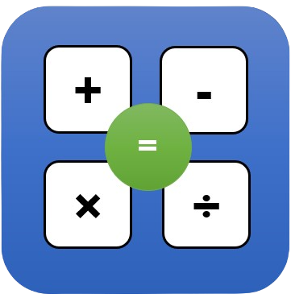

# Mathapp
</img>

## Descripción
Una aplicación web para entrenar a los niños y jóvenes en las operaciones básicas de las matemáticas.
## Instalación
1. Da clic [aquí](https://github.com/LisoProgrammer/mathapp/archive/refs/heads/main.zip) para descargar el ZIP.
